# TalentRadar System Architecture

This document provides a high-level overview of the TalentRadar system architecture, detailing the flow of data from the user interface through the multi-agent AI pipeline and back.

## High-Level Architecture Diagram

```mermaid
sequenceDiagram
    autonumber
    actor User
    participant UI as Next.js Frontend
    participant API as FastAPI Backend
    participant Agents as Multi-Agent Pipeline
    participant DB as ChromaDB
    participant LLM as Groq / Gemini API

    User->>UI: Pastes Raw Job Description
    UI->>API: POST /api/scout/stream
    
    API->>Agents: Trigger Async Pipeline
    
    %% Step 1
    rect rgb(30, 40, 30)
    Note over Agents,LLM: Step 1: Parse & Structure JD
    Agents->>LLM: Agent 1 extracts skills & seniority
    LLM-->>Agents: Returns Structured JSON
    API-->>UI: (SSE Chunk) "Parsing job description..."
    end
    
    %% Step 2
    rect rgb(30, 40, 50)
    Note over Agents,DB: Step 2: Semantic Scouting
    Agents->>DB: Agent 2 embeds JD & queries Vector DB
    DB-->>Agents: Top 5 Candidate Matches
    API-->>UI: (SSE Chunk) "Searching talent pool..."
    end
    
    %% Step 3
    rect rgb(40, 30, 40)
    Note over Agents,LLM: Step 3: Parallel Interview Simulation
    par Candidate 1 (Asyncio Semaphore)
        loop 6 Conversation Turns
            Agents->>LLM: Agent 3 (Recruiter) asks question
            LLM-->>Agents: 
            Agents->>LLM: Agent 4 (Candidate) answers
            LLM-->>Agents: 
        end
        Agents->>LLM: Agent 5 (Scorer) evaluates transcript
        LLM-->>Agents: JSON Interest Score & Explanation
        Note right of LLM: If Groq hits 429 Rate Limit,<br/>auto-fallback to Gemini.
        API-->>UI: (SSE Chunk) {Candidate 1 Data}
        UI->>UI: Live Re-sort & Update Dashboard
    and Candidates 2-5 (Concurrent)
        Agents->>LLM: Agents 3 & 4 converse
        LLM-->>Agents: 
        Agents->>LLM: Agent 5 scores transcript
        LLM-->>Agents: JSON Interest Score
        API-->>UI: (SSE Chunk) {Candidate N Data}
        UI->>UI: Live Re-sort & Update Dashboard
    end
    end

    API-->>UI: (SSE Chunk) {Status: Done}
    UI-->>User: Display Final Ranked Shortlist
```

## System Components

### 1. Frontend (Next.js)
* **Glassmorphic UI**: Uses Tailwind CSS and Framer motion to create a highly responsive, premium dark-mode interface.
* **Live Sorting**: Implements an SSE (Server-Sent Events) decoder that intercepts chunked data from the backend and performs `Array.sort()` in real-time, allowing users to watch the candidate ranks shift dynamically.

### 2. Backend (FastAPI)
* **Asynchronous Execution**: The entire pipeline is built on Python's `asyncio` to allow parallel I/O bound LLM calls.
* **Concurrency Control**: Utilizes `asyncio.Semaphore(2)` to strictly limit simultaneous LLM multi-turn conversations to 2, heavily reducing the likelihood of rate limits.
* **Live Streaming**: Exposes `/api/scout/stream` which uses a `StreamingResponse` generator to yield candidate JSON chunks directly to the client as soon as their respective evaluation finishes.

### 3. Multi-Agent System
* **Agent 1 (Parser)**: Standardizes raw user input into structured JSON.
* **Agent 2 (Scout)**: Translates the structured JD into an embedding vector and queries ChromaDB.
* **Agent 3 & 4 (Simulated Interview)**: A dynamic ping-pong loop where Agent 3 plays the recruiter and Agent 4 acts as the specific candidate based on their historical data.
* **Agent 5 (Scorer)**: Analyzes the resulting transcript, outputting an Interest Score and detailed rationale. Includes a "JSON Healer" to gracefully repair truncated LLM responses.

### 4. LLM Abstraction Layer (`llm_client.py`)
* **Primary**: Groq (`llama-3.3-70b-versatile`) for extreme speed.
* **Auto-Fallback**: If Groq returns a `429 Rate Limit Exceeded` error (due to its strict daily limits), the client intercepts the exception and seamlessly re-routes the exact same request to Google Gemini (`gemini-1.5-flash`), guaranteeing execution without interrupting the user experience.
