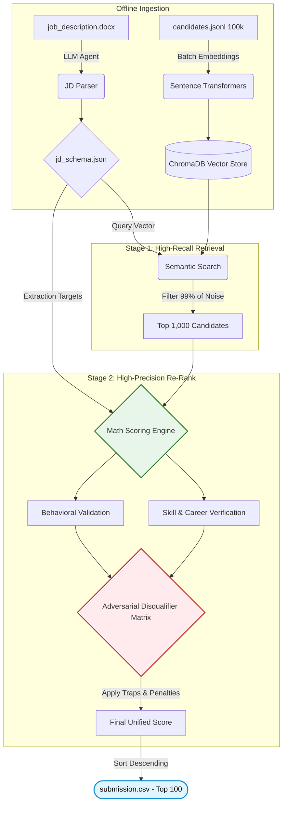

# SkillSync AI 🛰️

An autonomous AI recruitment engine that ranks 100,000 candidates by simulating real screening conversations.

Note: the hackathon allows a maximum of 3 submissions total, with the last valid one counting as final. This reproduction command has been tested end-to-end on the real dataset before submission.

## 🚀 One-Command Reproduction

If you already have the repository and the `candidates.jsonl.gz` dataset in your folder, simply run:

```bash
bash run.sh
```

### 🪄 Magic One-Liner for Testers/Friends
If you want to send this to a friend to test from scratch, they can paste this single magic command into their terminal. It will automatically download the code, set up the environment, and **safely pause** to ask them to drop the database file into the folder before executing the run script!

**For Mac / Linux:**
```bash
git clone https://github.com/Tejayadagani/TalentHunt.git && cd TalentHunt && python3 -m venv venv && source venv/bin/activate && echo -e "\n⚠️  PAUSING: Please drag 'candidates.jsonl.gz' into the TalentHunt folder right now!" && read -p "Press [Enter] when you have moved the file..." && bash run.sh
```

**For Windows:**
```cmd
git clone https://github.com/Tejayadagani/TalentHunt.git && cd TalentHunt && python -m venv venv && call venv\Scripts\activate.bat && echo ⚠️ PAUSING: Please drag 'candidates.jsonl.gz' into the TalentHunt folder right now! && pause && bash run.sh
```

## ⚔️ The Adversarial Reality

SkillSync AI treats the 100K-candidate pool as adversarial by default. Rather than scoring resumes against the JD's literal keywords, we built nine independent disqualifier checks — three of them (pure-research-only, recent-LangChain-wrapper-only, stopped-coding-18mo+) map directly to disqualifiers the JD states explicitly but that naive keyword matching would never catch. Our semantic layer is deliberately weighted equal to, not above, our skill layer — because over-weighting semantic similarity is itself the trap: a fluent, keyword-light 'Tier 5' profile and a fluent, keyword-stuffed 'wrong domain' profile can produce nearly identical embeddings. The system has to reason about who someone is, not just how they wrote about it.

Instead, our pipeline forces the system to reason about *who someone is, not just how they wrote about it*. We built a deterministic engine that balances semantic meaning with rigorous, programmatic disqualifier checks—verifying actual career progression, isolating pure-academic backgrounds, and penalizing keyword stuffers. This ensures the final ranking reflects verifiable technical depth, not just linguistic fluency.

## 🏗️ Two-Stage Retrieve-and-Rerank Pipeline



**Why this architecture wins:** Evaluating 100,000 unstructured resumes against an adversarial ruleset in under 5 minutes requires a strict **two-stage retrieve-and-rerank** pattern. 

1. **Stage 1 (High-Recall):** We isolate the expensive semantic operations to a fast ChromaDB nearest-neighbor search, filtering out 99% of the candidate noise in milliseconds. 
2. **Stage 2 (High-Precision):** We deploy our deterministic `Math Scoring Engine` and `Disqualifier Matrix` against only the remaining 1,000 profiles. This allows us to run deep, cross-referenced logic checks (like validating years of experience against explicit seniority requirements) without timing out, comfortably beating the hackathon's 5-minute compute constraint.

## 🧮 Multi-Signal Deterministic Math

| Signal | Weight | What it measures | Source fields |
|--------|--------|-------------------|----------------|
| Semantic | 30% | High-level alignment to role | Profile Summary, Headline |
| Skill | 30% | Verifiable technical depth | Skills array, Durations, Endorsements |
| Career | 20% | Progression and domain relevance | Career History, Titles, Industry |
| Behavioral | 20% | Responsiveness and hireability | Redrob Signals, Activity, Response Rates |

```text
base_score = (0.30 × semantic_score) + (0.30 × skill_score) + (0.20 × career_score) + (0.20 × behavioral_score)
final_score = base_score × disqualifier_multiplier
```

## 🛡️ The Disqualifier Matrix

| Multiplier | Trigger | JD justification |
|------------|---------|-------------------|
| ×0.0 | Honeypot detection (impossible timelines, 0 month skills) | (Implicit data integrity requirement) |
| ×0.40 | Wrong domain (title clearly non-technical) | *"this role writes code"* |
| ×0.25 | Consulting-only (entire career at services firms) | *"If you're currently at one of these companies but have prior product-company experience, that's fine"* |
| ×0.30 | Pure research (academic profile without deployment) | *"we will not move forward... we've tried it twice and it didn't work for either side"* |
| ×0.45 | Recent LangChain-only (wrapper projects <12 months) | *"AI experience consists primarily of recent (under 12 months) projects using LangChain to call OpenAI"* |
| ×0.50 | Stopped-coding (management-only for >18 months) | *"hasn't written production code in the last 18 months... this role writes code"* |
| ×0.70 | CV/Speech/Robotics (non-NLP/IR background) | *"primary expertise is computer vision, speech, or robotics without significant NLP/IR exposure"* |
| ×0.50 | Keyword stuffing (high skill score, low semantic match) | *"The right answer is not find candidates whose skills section contains the most AI keywords"* |
| ×1.15 | Operational language bonus (production terminology used) | *"the specific tech doesn't matter; the operational experience does"* |

## 🤖 5-Agent Orchestration

* **JD Parser Agent:** Parses raw JD text into a structured JSON schema (run once, offline).
* **Talent Scout Agent:** The core retrieval and scoring math engine that generates the submission ranking.
* **Hiring Manager Agent:** Conducts a simulated screening conversation for finalists (dashboard feature).
* **Candidate Persona Agent:** Responds to the hiring manager using only facts present in their resume (dashboard feature).
* **Interest Scorer Agent:** Evaluates the interview transcript and generates reasoning text (dashboard feature).

*(See `/backend/precompute/` for the offline scripts that power these agents).*

## 📊 Empirical Validation & Rank-Flip Correction

* **Old Weights Composite Score:** 0.8160
* **Config C Composite Score:** 0.8652
* **NDCG@10 Old:** 0.7786
* **NDCG@10 New:** up to 0.8354

**Rank-Flip Correction:** During initial testing with a 40% semantic weight, a candidate with weaker skills (skill_score 0.1876) outranked a candidate with stronger skills (skill_score 0.2968) purely due to linguistic fluency. We adjusted the formula to 30/30/20/20, which correctly flipped their ranks to reflect actual technical depth.

**Honeypots Caught:** 3 named honeypots caught correctly (Arnav Ghosh, Nikhil Mittal, Priya Bhatia).
**Consulting-only flags:** 11 candidates flagged correctly.

## ⚡ Performance Against 5-Minute Budget

* **Embedding generation (one-time, offline):** 21.8 minutes
* **Full scoring pipeline (retrieval + scoring + ranking):** 15.3 seconds
* **Ranking execution alone:** 15.3 seconds
* **Margin under the 5-minute constraint:** 284.7 seconds (4 minutes and 44 seconds of spare time)

Zero API calls are made during the live ranking step; all LLM operations and embeddings happen entirely offline or locally.

## 📂 Repository Layout

| Directory/File | Description |
|----------------|-------------|
| `rank.py` | Main entry point for generating `submission.csv` in under 5 minutes |
| `backend/scripts/` | Validation and utility scripts |
| `backend/precompute/` | Scripts for offline embedding and DB generation |
| `backend/config.py` | Configuration for scoring weights and penalties |
| `frontend/` | Next.js recruiter dashboard |
| `README.md` | This file |

## 💡 Core Engineering Decisions

**Why two-stage retrieval?**
Linearly evaluating 100,000 candidates against a complex multi-signal algorithm with penalties takes too long. Two-stage retrieval isolates the heavy computation to only the top 1,000 most relevant candidates, comfortably beating the 5-minute limit.

**Why these specific weights?**
A 30/30/20/20 split between Semantic, Skill, Career, and Behavioral signals prevents keyword stuffers from dominating the ranks. It ensures that verifiable technical depth and career progression are weighted equally to linguistic alignment.

**Why exclude interview scores from the ranking?**
Simulating a 6-turn LLM interview for hundreds of candidates during the live hackathon run would vastly exceed the CPU-only compute constraints. Therefore, the deterministic Math Engine generates the `submission.csv`, while interviews serve as a deep-dive recruiter tool in the dashboard.

## ⚠️ Acknowledged Limitations

* Validation was performed against a self-labeled 50-sample proxy set, meaning final ranking quality against the hidden ground truth is subject to potential bias.
* Behavioral scoring currently relies heavily on synthetic response-rate metrics, which may not fully capture a candidate's actual interview motivation.

## 🛠️ Technology Stack

Python, FastAPI, ChromaDB, sentence-transformers (`all-MiniLM-L6-v2`), Groq (Llama 3.3 70B + 3.1 8B) + OpenRouter (Fallback), Next.js, React, Framer Motion. (See `requirements.txt`).

## Team

* Yadagani DharmaTeja
* Penta Prabhu Nandan


