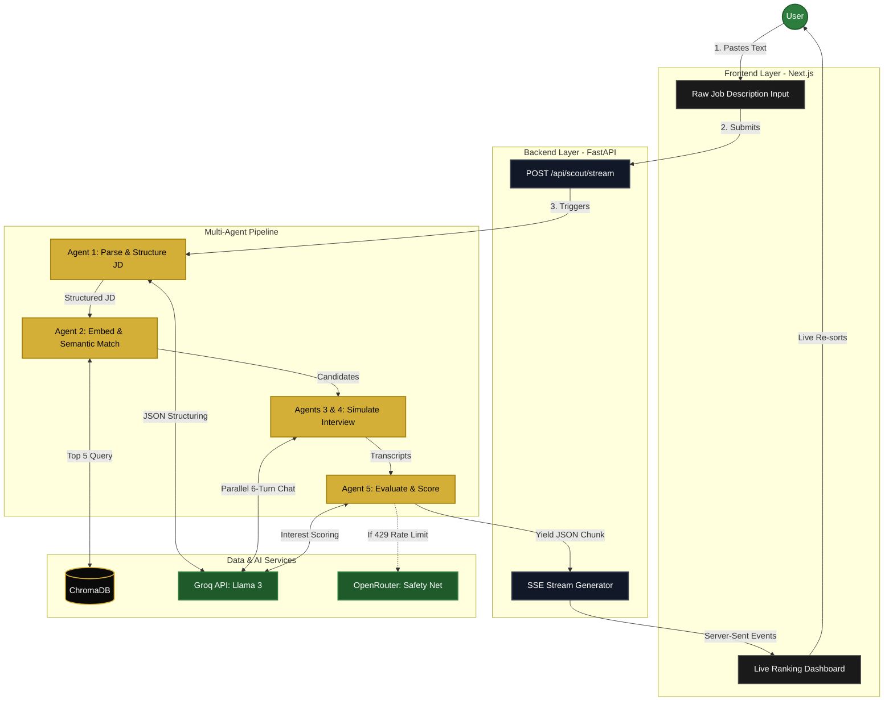

# 🛰️ TalentRadar: Autonomous AI Talent Scouting Agent

TalentRadar is a premium, AI-driven recruitment engine designed to transform raw job descriptions into highly qualified, ranked candidate shortlists. It goes beyond keyword matching by simulating deep-dive screening conversations with every candidate in your pool.

---

## 🏗️ System Architecture

Our architecture is designed for high-concurrency and real-time feedback using a multi-agent orchestration pattern.



---

## 🤖 The Multi-Agent Pipeline

TalentRadar utilizes a **5-Agent Pipeline** to evaluate candidates with extreme precision:

1. **Agent 1: The JD Parser**: Standardizes messy, raw text into a structured JSON schema of skills, seniority, and core requirements.
2. **Agent 2: The Talent Scout**: Performs high-speed semantic search over the **ChromaDB** vector store to find the top 5 most relevant profiles.
3. **Agent 3 & 4: The Interviewers**: Two agents engage in a 6-turn simulated interview. One plays the hiring manager, the other plays the candidate based on their actual resume data.
4. **Agent 5: The Scorer**: Evaluates the resulting transcript, awarding an **Interest Score** based on technical depth, cultural alignment, and proactive questioning.

---

## ✨ Key Features

- **Live SSE Streaming**: Candidates appear and re-sort themselves on your dashboard in real-time as their "interviews" finish.
- **LLM Auto-Fallback**: If the primary engine (Groq) hits a rate limit, the system automatically hot-swaps to OpenRouter's free tier to ensure zero downtime.
- **JSON Healing**: Advanced error handling that automatically repairs truncated LLM responses to prevent pipeline crashes.
- **Premium UI**: A high-contrast, glassmorphic dark-mode dashboard built with Framer Motion and Tailwind CSS.

---

## 🛠️ Tech Stack

- **Backend**: Python 3.12, FastAPI, Asyncio
- **Vector DB**: ChromaDB (all-MiniLM-L6-v2)
- **Frontend**: Next.js 14, Tailwind CSS, Lucide React
- **LLM Engines**: Groq (Llama-3.3-70b + 3.1-8b) + OpenRouter (Fallback)

---

## 🚀 Quick Start

### 1. Backend Setup
```bash
cd backend
python3 -m venv .venv && source .venv/bin/activate
pip install -r requirements.txt
cp .env.example .env   # Add your API keys (GROQ_API_KEY, OPENROUTER_API_KEY)

# Seed the database
python scripts/embed_candidates.py

# Start API
uvicorn app.main:app --reload
```

### 2. Frontend Setup
```bash
cd frontend
npm install
npm run dev
```

The application will be available at `http://localhost:3000`.
