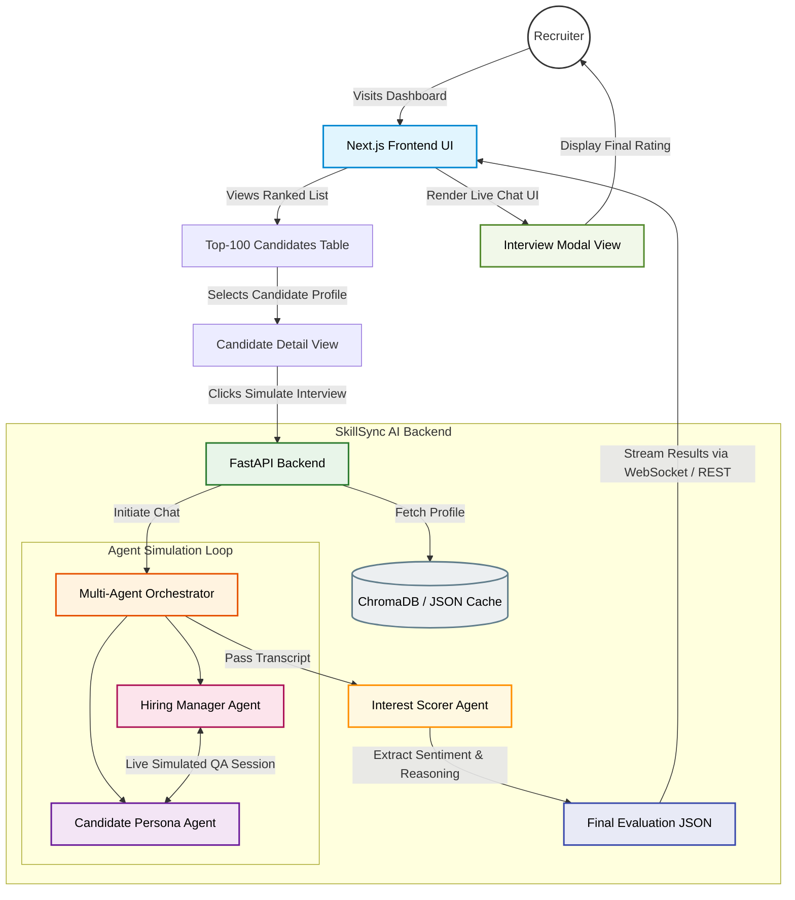

# 🌐 Full Website & Sandbox Workflow

This interactive Recruiter Dashboard operates completely separate from the offline hackathon ranking script. It demonstrates real-time interaction between the Next.js frontend, FastAPI backend, and the Multi-Agent interview system.
## System Architecture

